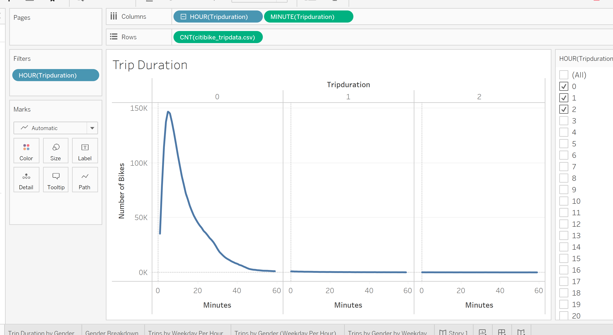
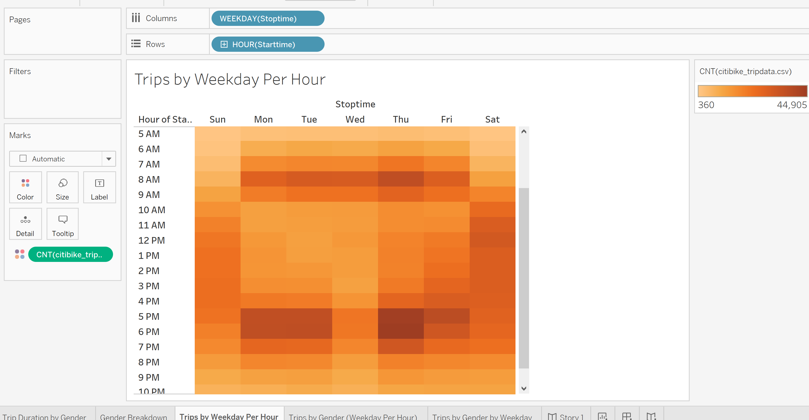
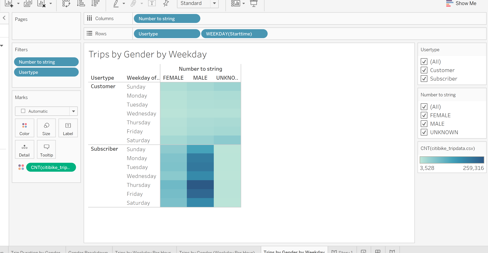
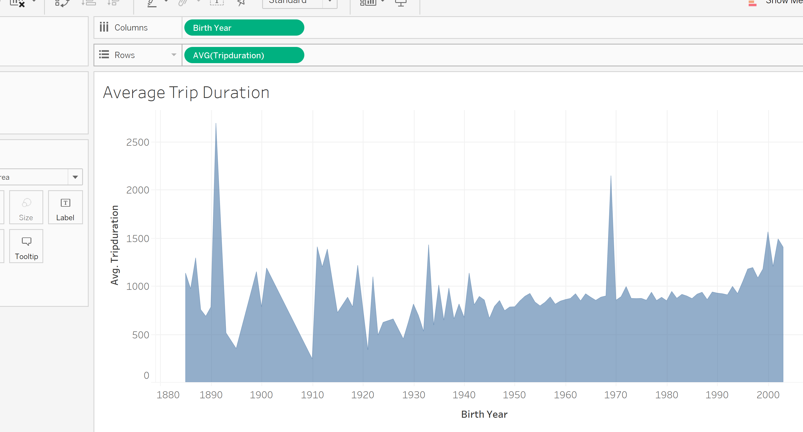
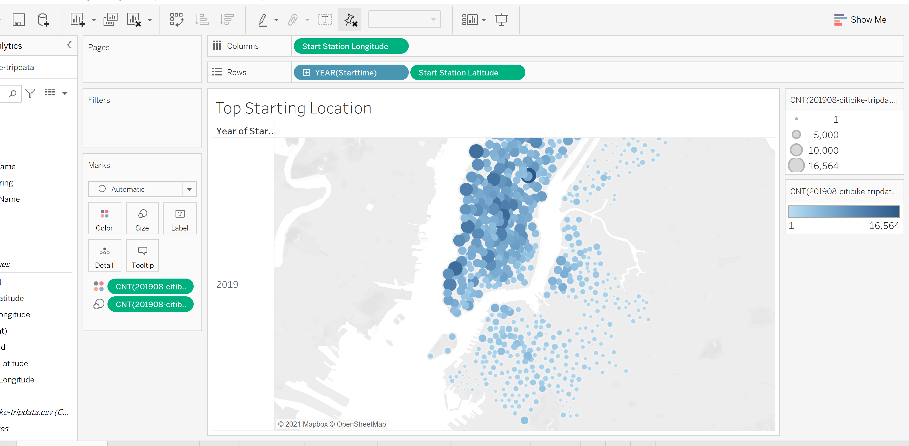

# Bikesharing

---

## Overview of the Analysis

The purpose of this analysis is to learn about the bikesharing data from NYC in preparation for creating a similar bike sharing business in another city. While some of the information cannot be directly copied, understanding the trends from a different location can be a good starting point for the new business plans. 

Link to tableau shows all worksheets, dashboards and the story created for this data. 

---

## Link to Code 

---

## Tableau Public Link

[https://public.tableau.com/profile/tamar.brand.perez#!/](https://public.tableau.com/profile/tamar.brand.perez#!/)

---

## Results

The results of the analysis based on the visualizations:

### Trip Duration

In the trip duration chart it shows that all trips are short. They all are completed in the first 30 minutes, many of them last up to about 20 minutes. The highest number of rides last 6 minutes. 

### Trip Duration by Gender

In the trip duration by gender the trips are divided by gender into male, female and unknown. There are many more trips taken by males but in terms of length of time, the trend is similar in all genders. All trips are short with a similar length of trip time. 

### Trips by Weekday per Hour

This chart shows the number of bikes used every hour, every day of the week. It is easy to see in this chart the high peak times, when more bikes are being used. In general, the high peak times are during weekdays during rush hour maybe when people are going to and from work. Roughly from 7am to 9am in the mornings and then from 4pm to 7pm in the evenings. Whereas on the weekend days the number of bikes being used is highest roughly from 10am to 6pm which is throughout the day. Wednesdays seem to have less rides especially at the end of the day compared to the other days at rush hour time. 

### Trips by Gender (Weekday per Hour)

.PNG)

When the trips are split by gender, the trends seem similar for male and female, however, the unknown gender do not follow the exact same trend. It seems as though the unknown gender have many trips throughout the day on weekends but on weekdays there is no significant rush hour in the mornings. The trips seem a little more evenly spread with some more trips in the end of the day rush hour time. 

### Trips by Gender by Weekday

One thing that stands out in this chart is that most males are subscribers and they use the bikes throughout the week, more heavily on Monday, Tuesday, Thursday and Friday but all days there are many males subscribers using bikes. Females, there are more subscribers than customers but the difference is not as big as it is for males between number of customers and number of subscribers. And for unknown gender, the number of subscribers is the lowest and there are more customers than subscribers of unknown gender. The differences in bike use for days of the week is not very significant even though there are some variations. 

### Average Trip Duration by Birth Year

This chart shows that there is a small increase in trip duration the younger a person is. With people older than 60 the data seems less predictable with some highs and lows possibly due to older people having more time but also being potentially less healthy.

### Top Starting Location

Shows the locations on the map where more trips were started using the size of the circle and the color to show the differences. 

---

## Summary

In conclusion, the data from NYC helps understand the breakdown of usage of bikes by gender, by time during the day and the week, by age, and by location. This information can be very helpful in planning to decide who is the target audience for this business when they might be interested in using the bikes, the location data could potentially be generalized for example, busier locations, or possibly locations with specific services. Other visualizations that might help shed more light would be looking at the location data and comparing it with points of interest on the map. For example, tourist attractions, schools, workplaces, and other places where more bikes may be used. This could potentially help explain why some locations had more or less bikes used. Another visualization that could be useful is checking if bikes were used in groups or by individuals. 

